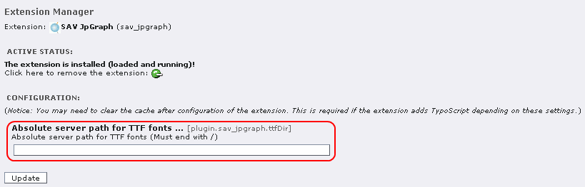
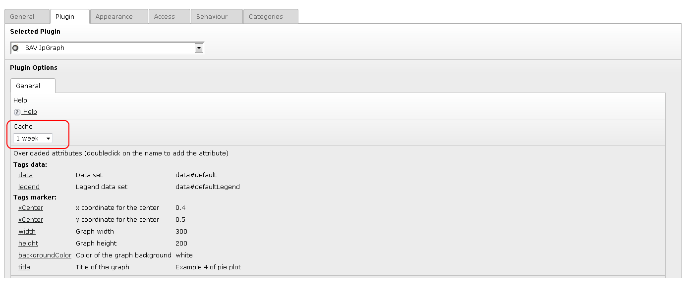

.. ==================================================
.. FOR YOUR INFORMATION
.. --------------------------------------------------
.. -*- coding: utf-8 -*- with BOM.

.. ==================================================
.. DEFINE SOME TEXTROLES
.. --------------------------------------------------
.. role::   underline
.. role::   typoscript(code)
.. role::   ts(typoscript)
   :class:  typoscript
.. role::   php(code)

Administration
==============

Configuration
-------------

The directory for the TTF fonts can be defined when installing the
extension. By default the following values are used by the JpGraph
library

::

   UNIX:
      TTF_DIR   /usr/share/fonts/truetype/

   WINDOWS:
      TTF_DIR   $SERVER_SYSTEMROOT/fonts/

If you want to use another configuration, fill the Absolute server
path.

Caching
-------

The processing in SAV Jpgraph is based on the interpretation of an XML file 
where tags are associated with objects (from JpGraph classes or from data,
query, file, marker, template classes). You may split the processing in several
XML file or strings as done in the “sav_jpgraph” extension or have all the XML
tags inserted in the same file. 

Due to the interpretation process, the use of XML templating is flexible but
runs slower than the conventional php coding. When queries are not used, the
TYPO3 caching system is active to speed up the rendering.

Since version 0.2.0, a caching system was introduced in SAV Jpgraph to speed up 
the rendering with queries. 

.. important::
  The flag “Allow queries (Admin)” must be set by an Admin user in the content 
  flexform to have the query executed.

The caching time can be set by an **ADMIN user** using the selector in the 
flexform as shown below. By default, there is no caching.

