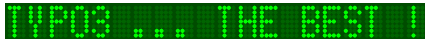
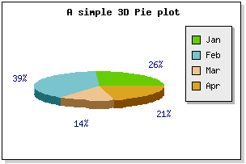

.. ==================================================
.. FOR YOUR INFORMATION
.. --------------------------------------------------
.. -*- coding: utf-8 -*- with BOM.

.. ==================================================
.. DEFINE SOME TEXTROLES
.. --------------------------------------------------
.. role::   underline
.. role::   typoscript(code)
.. role::   ts(typoscript)
   :class:  typoscript
.. role::   php(code)

Introduction
============

What does it do?
----------------

This extension introduces a new concept for dealing with the JpGraph
library. It makes it possible to develop JpGraph templates in XML. The
XML templates are easily written from the php examples provided with
the JpGraph library.

Markers can be introduced in templates. Data can also be changed
through XML either manually or by means of queries if an Admin user
has authorized it.

JpGraph information can be found at `http://www.aditus.nu/jpgraph/
<http://www.aditus.nu/jpgraph/>`_

JpGraph is released under a dual license. `QPL 1.0 (Qt Free Licensee)
<http://en.wikipedia.org/wiki/Q_Public_License>`_ For non-commercial,
open-source or educational use and JpGraph Professional License for
commercial use. `The professional version
<http://www.aditus.nu/jpgraph/proversion.php>`_ also includes
additional features and support.

Screenshots
-----------

Simple example with user defined data and color
^^^^^^^^^^^^^^^^^^^^^^^^^^^^^^^^^^^^^^^^^^^^^^^

.. figure:: ../Images/ScreenshotsPolarPlot.png  

Example using a query
^^^^^^^^^^^^^^^^^^^^^

.. figure:: ../Images/ScreenshotsBarPlotWithQueriesFlexform.png  

.. figure:: ../Images/ScreenshotsBarPlotWithQueries.png  

Others examples
^^^^^^^^^^^^^^^

