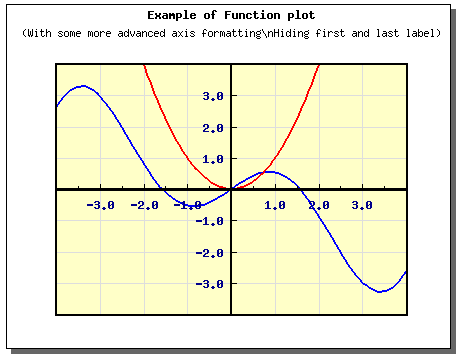
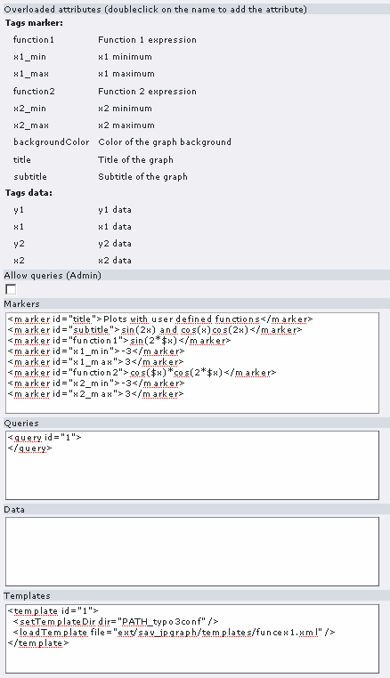
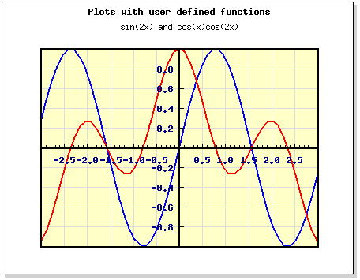

.. ==================================================
.. FOR YOUR INFORMATION
.. --------------------------------------------------
.. -*- coding: utf-8 -*- with BOM.

.. ==================================================
.. DEFINE SOME TEXTROLES
.. --------------------------------------------------
.. role::   underline
.. role::   typoscript(code)
.. role::   ts(typoscript)
   :class:  typoscript
.. role::   php(code)

Dealing with functions: the “return” attribute
----------------------------------------------

The JpGraph library makes it possible to display curves from
functions. In this case, the “FuncGenerator” is used and the returned
values become the data to process.

Let use illustrate the concept on the funcex1.php example.
Instructions relative to the FuncGenerator is:

::

   $f = new FuncGenerator('cos($x)*$x');
   list($xdata,$ydata) = $f->E(-1.2*M_PI,1.2*M_PI);

The evaluation of the expression is done by means of the “E” method
which returns a two-dimensional arrays of data.

To translate this in XML, the “return” attributes will be used and
data will be accessed through reference attributes and the
<setDataFromArray> tag. It gives:

::

     <FuncGenerator id="1" func="cos($x)*$x">
       <E xmin="-4" xmax="4" return="data#1" />
     </FuncGenerator>
     <data id='x1'>
       <setDataFromArray ref="data#1" index="0" />
     </data>
     <data id='y1'>
       <setDataFromArray ref="data#1" index="1" />
     </data>

Displaying the template leads to:

Once again, by means of markers, the functions to display can be
easily changed in the content flexform.

The result in FE becomes:

