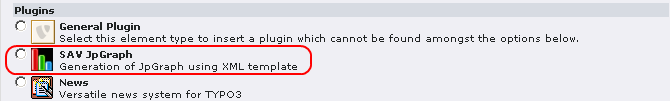
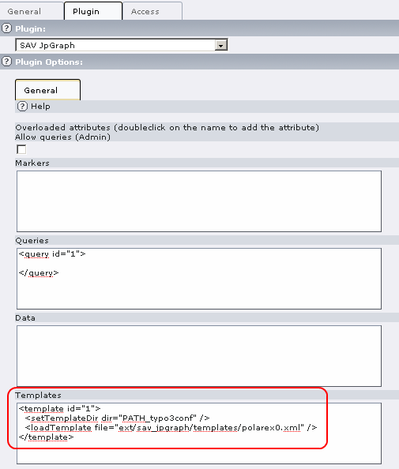
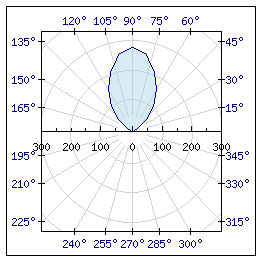

.. ==================================================
.. FOR YOUR INFORMATION
.. --------------------------------------------------
.. -*- coding: utf-8 -*- with BOM.

.. ==================================================
.. DEFINE SOME TEXTROLES
.. --------------------------------------------------
.. role::   underline
.. role::   typoscript(code)
.. role::   ts(typoscript)
   :class:  typoscript
.. role::   php(code)

Designing a basic XML template from an example
----------------------------------------------

Introduction
^^^^^^^^^^^^

The JpGraph library includes hundreds of examples. They are in the
directory “Classes/JpGraph/Examples”. Let us illustrate the principle on a simple
example: polarex0.php. The file content is given below.

::

   <?php
   // A simple Polar graph, example 0

   include "../jpgraph.php";
   include "../jpgraph_polar.php";

   $data = array(0,1,10,2,30,25,40,60,
                 50,110,60,160,70,210,75,230,80,260,
                 85,270,90,280,
                 95,270,100,260,105,230,
                 110,210,120,160,130,110,140,60,
                 150,25,170,2,180,1);

   $graph = new PolarGraph(250,250);
   $graph->SetScale('lin');
   $graph->SetMargin(35,35,25,25);

   $p = new PolarPlot($data);
   $p->SetFillColor('lightblue@0.5');
   $graph->Add($p);

   $graph->Stroke();

   ?>

Translating Data
^^^^^^^^^^^^^^^^

Data will be inserted in a XML tag <data> with an “id” attribute (“id”
is a reserved word) to reference later these data. It gives:

::

     <!-- Define the default data -->
     <data id="defaultData">
   0,1,10,2,30,25,40,60,
   50,110,60,160,70,210,75,230,80,260,
   85,270,90,280,
   95,270,100,260,105,230,
   110,210,120,160,130,110,140,60,
   150,25,170,2,180,1
     </data>

Translating new Object
^^^^^^^^^^^^^^^^^^^^^^

Each time a JpGraph new object is created in php, transform it in a
XML tag. The parameters become attributes. Thus,

::

   $graph = new PolarGraph(250,250);

becomes

::

   <PolarGraph width="250" height="250">
   </PolarGraph>

You can use any name for the attributes, however it is always better
to use names that makes sense. For example, you can use the same name
as the parameter in the php class . The order of the values must be
the same as in php.

Translating methods associated with objects
^^^^^^^^^^^^^^^^^^^^^^^^^^^^^^^^^^^^^^^^^^^

For each method, define a tag with the same name with attributes in
the same order. Once again, the name for attributes is your choice.
Put this tag inside the tag associated with the object. Thus,

::

   $graph->SetMargin(35,35,25,25);

becomes

::

   <SetMargin left="35" right="35" top="25" bottom="25" />

Because, “$graph” is associated with the tag “PolarGraph”, the
previous tag should be inserted inside it. Thus, it gives:

::

     <PolarGraph width="250" height="250">
       <SetMargin left="35" right="35" top="25" bottom="25" />
     </PolarGraph>

Setting reference to already defined objects
^^^^^^^^^^^^^^^^^^^^^^^^^^^^^^^^^^^^^^^^^^^^

As you can see in the php code, a PolarPlot object is created and is
“added” to the PolarGraph by means of the statement:

::

   $graph->Add($p);

In such a case, always define the graphic element before as described
previously and give it an identification by means of an “id”
attribute. In order to associate the data as in the “new
PolarPlot($data”);” statement, we will use a “ref” attribute (“ref” is
a reserved word). The syntax is “tagName#id”. For example
“data#defaultData” refers to the <data> tag whose id is “defaultData”.
Thus, we obtain:

::

     <!-- Define the plot -->
     <PolarPlot id="1" ref="data#defaultData">
     </PolarPlot>

Now, we can add the PolarPlot to the PolarGraph using the “id” of the
PolarPlot:

::

     <!-- Define the graph -->
     <PolarGraph width="250" height="250">
       <SetMargin left="35" right="35" top="25" bottom="25" />
       <Add ref="PolarPlot#1" />
     </PolarGraph>

Saving the resulting image filename
^^^^^^^^^^^^^^^^^^^^^^^^^^^^^^^^^^^

The resulting image should be provided to the method “Stroke”
($graph->Stroke();). A predefined file name is set by the extension.
The filename is “typo3temp/sav\_jpgraph/im\_xxxx.png” where “xxxx” is
the content object id. This file is defined by means of a hidden XML
<file> tag whose id is “1”. Therefore, you must translate the “Stroke”
call in:

::

       <Stroke ref="file#1" />

The simple XML template
^^^^^^^^^^^^^^^^^^^^^^^

After applying all the previous rules, the resulting template is:

::

   <?xml version="1.0" encoding="utf-8"?>
   <jpgraph>

     <!-- Define the default data -->
     <data id="defaultData">
   0,1,10,2,30,25,40,60,
   50,110,60,160,70,210,75,230,80,260,
   85,270,90,280,
   95,270,100,260,105,230,
   110,210,120,160,130,110,140,60,
   150,25,170,2,180,1
     </data>

     <!-- Define the plot -->
     <PolarPlot id="1" ref="data#defaultData">
       <SetFillColor color="lightblue@0.5" />
     </PolarPlot>

     <!-- Define the graph -->
     <PolarGraph width="250" height="250">
       <SetScale type="lin" />
       <SetMargin left="35" right="35" top="25" bottom="25" />
       <Add ref="PolarPlot#1" />
       <Stroke ref="file#1" />
     </PolarGraph>

   </jpgraph>

Displaying the template
^^^^^^^^^^^^^^^^^^^^^^^

Insert a new content in your page and select the SAV JpGraph plugin.

The extension comes with a flexform with predefined XML elements. Fill
the Templates part as shown below. The tag <setTemplateDir> is used to
set the directory root by interpreting TYPO3 constant. You can use
predefined php constants in any tag, they will be replaced by their
value. Use the tag <loadTemplate> to load the template. The following
configuration will load the template file
“typo3conf/ext/sav\_jpgraph/templates/polarex0.xml”.

Finally, view your page and you should obtain the following display.

