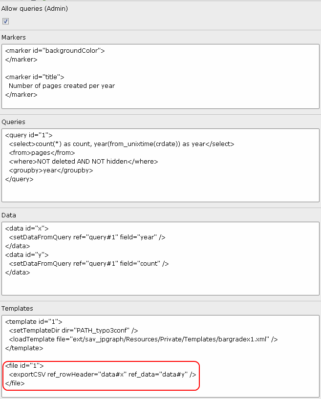
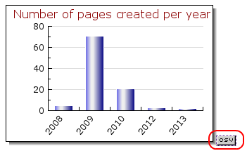

.. ==================================================
.. FOR YOUR INFORMATION
.. --------------------------------------------------
.. -*- coding: utf-8 -*- with BOM.

.. ==================================================
.. DEFINE SOME TEXTROLES
.. --------------------------------------------------
.. role::   underline
.. role::   typoscript(code)
.. role::   ts(typoscript)
   :class:  typoscript
.. role::   php(code)

Exporting data in CSV
---------------------

An new feature was implemented in version 0.2.0 which makes it possible to
export graph data in CSV.

For example, assume that you want to export data associated with the bar graph
described in the section "Getting data from queries". It can be simply done by
using the exportCSV method defined for the tag <file> as shown below.

The file id refers to the defaut. The exportCSV method has two arguments.
The first one is the reference to the legend used as the rowheader while the
second one is the reference to the data to export. Now, in the front end you should
see an icon at the left hand side of the graph.

Click on the icon to open the CSV file.