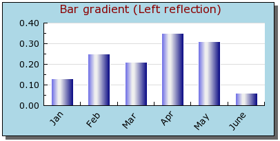
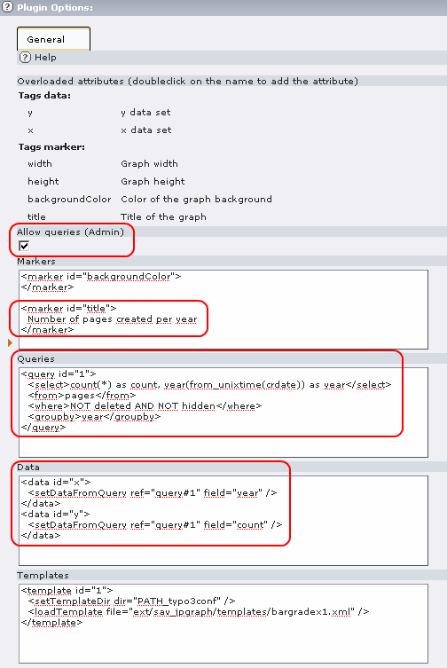
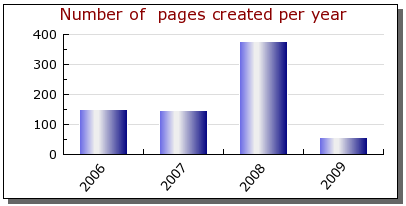

.. ==================================================
.. FOR YOUR INFORMATION
.. --------------------------------------------------
.. -*- coding: utf-8 -*- with BOM.

.. ==================================================
.. DEFINE SOME TEXTROLES
.. --------------------------------------------------
.. role::   underline
.. role::   typoscript(code)
.. role::   ts(typoscript)
   :class:  typoscript
.. role::   php(code)

Getting data from queries
-------------------------

Assume that we want to display the number of pages created per year on
a TYPO3 website in a bar graph. Assume also that we decided to use the
template "barradex1.xml" provided in the “Resources/Privates/Templates” directory of this
extension.

Displaying the template as described in the previous section leads to
the following image.

The template code is the following:

::

   <?xml version="1.0" encoding="utf-8"?>
   <jpgraph>

     <!-- Define the comments for overloading tags -->
     <comments>
       <languageKey index="default">
         <label index="data#x">x data set</label>
         <label index="data#y">y data set</label>
         <label index="marker#title">Title of the graph</label>
         <label index="marker#backgroundColor">Color of the graph background</label>
         <label index="marker#width">Graph width</label>
         <label index="marker#height">Graph height</label>
       </languageKey>
     </comments>

     <!-- Define the data -->
     <data id="y_default">
       <setData value="0.13,0.25,0.21,0.35,0.31,0.06" />
     </data>
     <data id="x_default">
       <setData value="Jan,Feb,Mar,Apr,May,June" />
     </data>

           <!-- Create the bar plot  -->
     <BarPlot id="1" ref="data#y_default" ref_ref="data#y">
       <SetWidth coeff="0.6" />
       <SetFillGradient fromColor="navy" toColor="#EEEEEE" style="GRAD_LEFT_REFLECTION" />
       <SetColor color="white" />
     </BarPlot>

     <!-- Set up the graph -->
     <Graph width="400" height="200" type="auto">
       
         <SetMargin left="60" right="20" top="30" bottom="50" />
       </img>
       <SetScale type="textlin" />
       <SetMarginColor color="lightblue" ref_color="marker#backgroundColor" />
       <SetShadow />
       <title>
         <Set title="Bar gradient (Left reflection)" ref_title="marker#title" />
         <SetFont family="FF_VERDANA" style="FS_NORMAL" size="12" />
         <SetColor color="darkred" />
       </title>
       <xaxis>
         <SetFont family="FF_VERDANA" style="FS_NORMAL" size="10" />
         <SetTickLabels ref="data#x_default" ref_ref="data#x" />
         <SetLabelAngle angle="50" />
       </xaxis>
       <yaxis>
         <SetFont family="FF_VERDANA" style="FS_NORMAL" size="10" />
       </yaxis>
       <yscale>
         <ticks>
           <SupressZeroLabel flag="false" />
         </ticks>
       </yscale>
       <Add ref="BarPlot#1" />
       <Stroke ref="file#1" />
     </Graph>

   </jpgraph>

As it can be seen, we may change the data set by means of the tags:

::

   <data id="x"></data>
   <data id="y"></data>

The title and the background color can be changed by means of the
tags:

::

   <marker id="title"></marker>
   <marker id="backgroundColor"></marker>

To obtain the data from queries, special tags <setDataFromQuery> must
be introduced in the <data> section as shown below:

::

   <data id="x">
     <setDataFromQuery ref="query#1" field="year" />
   </data>
   <data id="y">
     <setDataFromQuery ref="query#1" field="count" />
   </data>

The tag <setDataFromQuery> refers to a reference attribute “ref”
concerning the tag “query” whose “id” is 1. Another attribute concerns
the field that should be used to collect the data.

Then a query tag must be defined as follows:

::

   <query id="1">
     <select>count(*) as count, year(from_unixtime(crdate)) as year</select>
     <from>pages</from>
     <where>NOT deleted AND NOT hidden</where>
     <groupby>year</groupby>
   </query>

Tags <select>, <from>, <where>, <groupby>, <orderby>, <limit> can be
used in the <query> tag. They have the same meaning as in the SQL
SELECT statement.

.. important::
  The flag “Allow queries (Admin)” must be set by an Admin user in the
  content flexform to have the query executed.

Loading the FE page leads to an image similar as the following.

