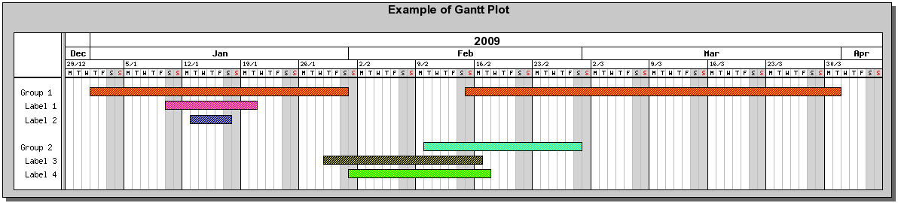

.. ==================================================
.. FOR YOUR INFORMATION
.. --------------------------------------------------
.. -*- coding: utf-8 -*- with BOM.

.. ==================================================
.. DEFINE SOME TEXTROLES
.. --------------------------------------------------
.. role::   underline
.. role::   typoscript(code)
.. role::   ts(typoscript)
   :class:  typoscript
.. role::   php(code)

Repeating sequences: the <foreach> special tag
----------------------------------------------

It may be necessary to repeat sequences for creating a graph. For
example, GanttBar objects must be associated with the Gantt graph. To
have a generic template, the GanttBar configuration will be put into
an array so that the number of GanttBar objects to create is the size
of the array. Let us illustrate how to deal with it using the
ganttex.xml file.

The configuration of the GanttBar object is defined with a <data> tag
used to set the array as shown below:

::

     <data id="defaultBarConfig">
       <setArray value="0, Group 1, 2009-01-01, 2009-01-31" />
       <setArray value="1,  Label 1, 2009-01-10, 2009-01-20" />
       <setArray value="2,  Label 2, 2009-01-13, 2009-01-17" />
       <setArray value="4, Group 2, 2009-02-10, 2009-02-28" />
       <setArray value="5,  Label 3, 2009-01-29, 2009-02-16" />
       <setArray value="6,  Label 4, 2009-02-01, 2009-02-17" />
       <setArray value="0,, 2009-02-15, 2009-03-31" />
     </data>

The configuration of each GanttBar is given by means of a comma-
separated list. The color of each Ganttbaris also defined by a <data>
tag. Obviously, the number of colors must be the same as the number of
arrays in the previous configuration.

::

     <data id="defaultBarColorConfig">
       red,magenta,blue,cyan,black,green,red
     </data>

Now we have to create the GanttBar objects using the previous
configurations. A <foreach> tag is used as follows:

::

      <foreach ref="data#defaultBarConfig" ref_ref="data#userBarConfig">
       <GanttBar id="1" ref="data#defaultBarConfig" ref_ref="data#userBarConfig">
         <SetPattern type="BAND_RDIAG" color="yellow" ref_color="marker#color" />
         <SetFillColor ref="data#defaultBarColorConfig" ref_ref="data#userBarColorConfig"/>
       </GanttBar>
     </foreach>

The “ref” attribute of the <foreach> tag is here
"data#defaultBarConfig" which means that each element in the <data>
tag whose “id” is “defaultBarConfig” will be processed. An “id” is
associated with the GanttBar object. This “id” is related to an array
of GanttBar objects. The reference to the configuration is provided by
"data#defaultBarConfig" and the “ref\_ref” attribute, already
explained in the previous examples, defines the reference that must be
set by the user.

The method “SetFillColor” is associated with the reference
“data#defaultBarColorConfig” which can also be overloaded by the user.

Finally, the GanttBar objects must be “Added” to the GanttGraph. Once
again the <foreach> tag is used in the <GanttGraph> tag as shown
below.

::

     <GanttGraph width="0" height="0" cache="auto">
       ....
   
       <foreach ref="GanttBar#1">
         <Add ref="GanttBar#1" />
       </foreach>
   
       ....
     </GanttGraph>

The “Add method” is associated with the reference “GanttBar#1”, that
is the <GanttBar> tag whose “id” is equal to 1.

Finally, let us note that the locale settings is taken into account by
means of a predefined constant LOCALE in the SAV Graph extension.

Loading the example “ganttex.xml” in the templates section of the SAV
Graph extension leads to the following result in FE.

