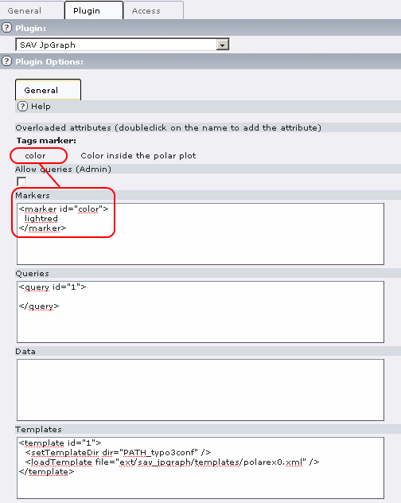
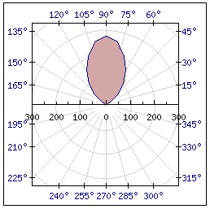
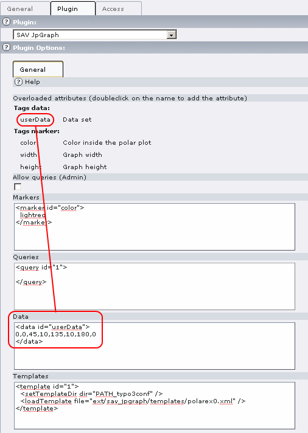
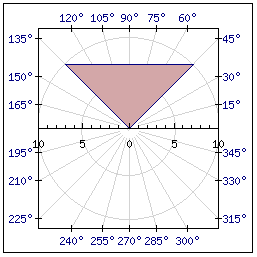

.. ==================================================
.. FOR YOUR INFORMATION
.. --------------------------------------------------
.. -*- coding: utf-8 -*- with BOM.

.. ==================================================
.. DEFINE SOME TEXTROLES
.. --------------------------------------------------
.. role::   underline
.. role::   typoscript(code)
.. role::   ts(typoscript)
   :class:  typoscript
.. role::   php(code)

Setting user data and markers references
----------------------------------------

In order to make a generic template, user data and markers can be
introduced. In the previous example, let us assume that we want to
make the color inside the polar curve and the data configurable for
content objects.

This task is performed in some manner by overloading specific
attributes in the template with a reference. The syntax is similar to
the “ref” attribute. Use ref\_abcd=“tagName#id” to overload the
attribute “abcd” with the “tagName” element with the given “id”.

Marker reference for the color
^^^^^^^^^^^^^^^^^^^^^^^^^^^^^^

For example, to overload the color inside the polar plot with the
“marker” whose id is “color”, a slight modification of the concerned
line is necessary:

::

       <SetFillColor color="lightblue@0.5" ref_color="marker#color" />

Add also a <comments> tag at after the <jpgraph> tag.

::

     <comments>
       <languageKey index="default">
         <label index="marker#color">Color inside the polar plot</label>
       </languageKey>
     </comments>

Now, in the plugin configuration, the overloaded attributes section is
automatically filled with the marker and its comments. Double-click on
the tag name, that is “color” and fill the markers section as shown
below.

Reload you page in FE and you should obtain a new display with the
color inside the polar plot in “lightred”.

 
Data reference for user data
^^^^^^^^^^^^^^^^^^^^^^^^^^^^

You may also want to change the data using the “Data” section, once
again a small modification of the concerned line is necessary:

::

     <PolarPlot id="1" ref="data#defaultData" ref_ref="data#userData">

As it can be seen, we overload the “ref” attribute with data provided
in the <data> section whose id is “userData”.

Using the provided template, the overloaded attributes section is
automatically filled with the data and its comments. Double-click on
the tag name and fill the data section as shown below.

Reload your page in FE and you should obtain the following figure.

 
The final template
^^^^^^^^^^^^^^^^^^

::

   <?xml version="1.0" encoding="utf-8"?>
   <jpgraph>
   
     <!-- Define the comments for overloading tags -->
     <comments>
       <languageKey index="default">
         <label index="data#userData">Data set</label>
         <label index="marker#color">Color inside the polar plot</label>
         <label index="marker#width">Graph width</label>
         <label index="marker#height">Graph height</label>
       </languageKey>
     </comments>
     
     <!-- Define the default data -->
     <data id="defaultData">
   0,1,10,2,30,25,40,60,
   50,110,60,160,70,210,75,230,80,260,
   85,270,90,280,
   95,270,100,260,105,230,
   110,210,120,160,130,110,140,60,
   150,25,170,2,180,1
     </data>
   
     <!-- Define the plot -->
     <PolarPlot id="1" ref="data#defaultData" ref_ref="data#userData">
       <SetFillColor color="lightblue@0.5" ref_color="marker#color" />
     </PolarPlot>
   
     <!-- Define the graph -->
     <PolarGraph width="250" ref_width="marker#width" height="250" ref_height="marker#height">
       <SetScale type="lin" />
       <SetMargin left="35" right="35" top="25" bottom="25" />
       <Add ref="PolarPlot#1" />
       <Stroke ref="file#1" />
     </PolarGraph>
   
   </jpgraph>

How to copy the image in a given file
^^^^^^^^^^^^^^^^^^^^^^^^^^^^^^^^^^^^^

Sometimes it is useful to have a copy of the image in a given file. It
can easily be done with specific tags in the <template> tag as shown
below:

::

   <template id="1">
     <setTemplateDir dir="PATH_typo3conf" />
     <loadTemplate file="ext/sav_jpgraph/Resources/Private/Templates/bargradex1.xml" />

      <setCopyImageDir dir="PATH_site" />
      <CopyImageInFile ref="file#1" file="fileadmin/test.png" />
   </template>

In the code in bold, a directory is defined to have the constant
PATH\_site interpreted. As explain previously, the file used to store
the image is by default in the reference “file#1”. It is copied into
the destination file. Go to “fileadmin” and verify that you have got
the file “test.png”.